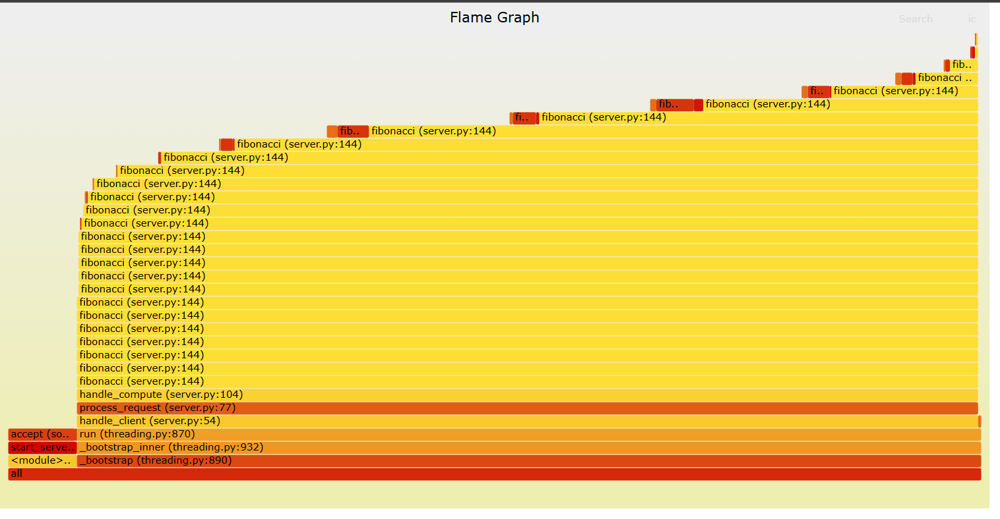

# Flamegraph-demo

## Install the official tools

```bash
git clone https://github.com/brendangregg/FlameGraph.git
```


## Terminal 1: Start server

```bash
python3 server.py
```

## Terminal 2: Generate load

```bash
python3 -c "
import socket, json, time
for i in range(10):
    s = socket.socket()
    s.connect(('localhost', 8888))
    s.send(json.dumps({'type': 'compute', 'number': 30}).encode())
    s.recv(1024)
    s.close()
    time.sleep(0.2)
" &
```

## Terminal 3: Profile with correct orientation

```bash
py-spy record --format raw -o profile.raw -d 15 -p $(pgrep -f "python3 server.py")
./FlameGraph/flamegraph.pl profile.raw > correct_flamegraph.svg
``` 

Run the following command to serve the flamegraph.svg file:

```bash
python3 -m http.server 8000
```


