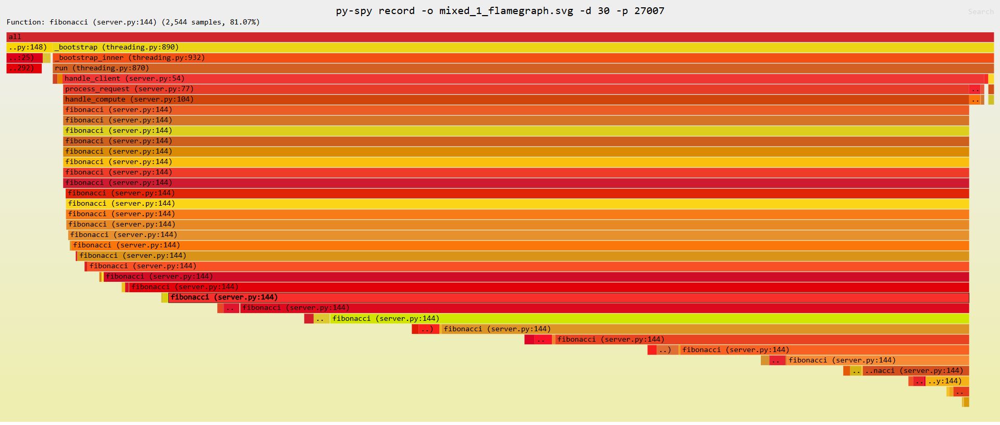

# Flamegraph-demo

Terminal 1: 

```bash
python3 server.py
```

Terminal 2: 

```bash
python3 client.py (choose option 3)
```

> You can also choose option 1 or 2 to test the single message or persistent connection test.

Terminal 3:

```bash
py-spy record -o mixed_flamegraph.svg -d 30 -p $(pgrep -f "python3 server.py")
```

Run the following command to serve the flamegraph.svg file:

```bash
python3 -m http.server 8000
```


